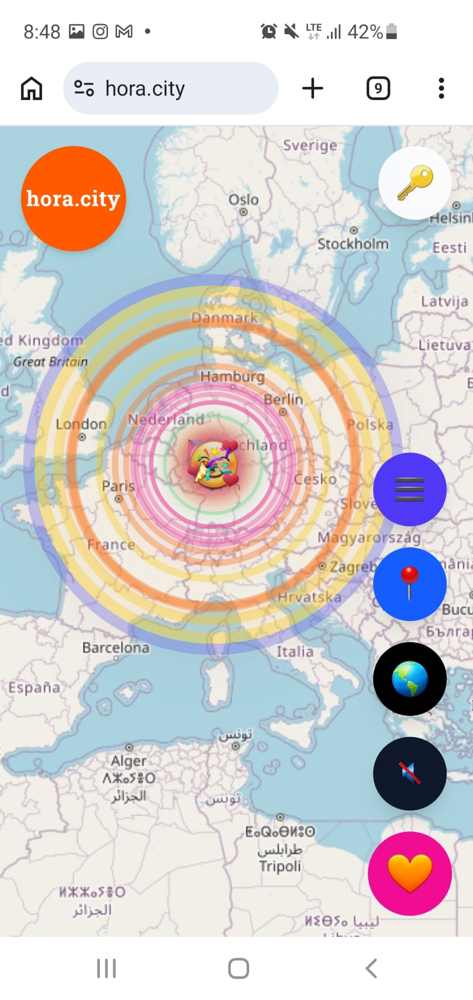

# HORA.city Engineering

**Engineering a real-time, location-based social system for the physical world.**

HORA.city is a full-stack web product exploring how people can create, discover, and interact with digital entities anchored to real places.

The system combines geolocation, domain state, persistence, map rendering, evolving entity behavior, and mobile-first UI/UX.

**Live product:** https://www.hora.city

> This repository is an engineering showcase.
> The production source code remains private.

---



## What I built

HORA.city was conceived, designed, and built end-to-end by **Valéria dos Santos Reiser**.

My work spans:

* product design;
* UI/UX;
* frontend architecture;
* React / Next.js implementation;
* geolocation;
* map-based interaction;
* API design;
* application behavior;
* domain modeling;
* persistence;
* projection and rendering;
* debugging;
* performance investigation;
* deployment;
* architectural evolution;
* AI-assisted software engineering.

The project is not a tutorial or isolated proof of concept.

It is an evolving product and a real engineering environment where product decisions, architecture, runtime behavior, performance, and system understanding meet.

---

# Product concept

At the surface, the interaction is simple:

```text
Person
  ↓
Physical location
  ↓
Digital entity
  ↓
Interaction
  ↓
State evolution
  ↓
Visible city pattern
```

A user creates or interacts with an entity associated with a geographic location.

Other people may later encounter, join, care for, or otherwise affect that entity.

The engineering complexity comes from maintaining consistency across location, time, users, state, persistence, and representation.

---

# From Hearts to HORA

The original product model started with four dimensions:

```text
H — Hearts
O — Origin
R — Routes
A — Auras
```

The first implementation focused primarily on **Hearts**.

As the product evolved, this initial model expanded into a broader architecture centered on:

```text
People
×
Digital Entities
×
World
```

This evolution introduced clearer concepts around:

* origin;
* mobility;
* persistence;
* witnesses;
* resonance;
* links;
* routes;
* world context.

The architecture continues to evolve incrementally rather than through a complete rewrite.

---

# The Heart domain

The original core domain entity was the `Heart`.

A Heart combines several kinds of information:

```text
Heart
├── location
├── origin
├── participants
├── state
├── lifetime
├── interactions
└── events
```

Heart behavior is not simple CRUD.

Its state can depend on:

* geographic proximity;
* time;
* number of participants;
* previous interactions;
* persistence rules;
* accumulated participation.

A visible heart on the map is therefore the result of domain behavior, not simply a database row rendered directly to the screen.

---

# Domain events

User interactions are represented through explicit domain events such as:

```text
HeartCreated
HeartJoined
HeartEvolved
```

These events help distinguish:

```text
what happened
```

from:

```text
how that state is stored
```

and from:

```text
how that state is eventually rendered
```

This distinction became increasingly important as the application grew.

---

# End-to-end architecture

A user interaction may travel through several system boundaries:

```text
User Interaction
      ↓
UI
      ↓
Request
      ↓
API
      ↓
Application
      ↓
Domain Decision
      ↓
Repository
      ↓
Database
      ↓
Response
      ↓
Projection
      ↓
Renderer
      ↓
Visible UI State
```

To the user, this may feel like one action.

From an engineering perspective, each layer has a different responsibility and can introduce, preserve, transform, or misrepresent information.

Maintaining those boundaries became one of the central architectural concerns of the project.

---

# Technical stack

The production system has been built primarily with:

* **Next.js**
* **React**
* **JavaScript**
* **React Leaflet**
* **Tailwind CSS**
* **MongoDB Atlas**
* **Vercel**
* browser geolocation APIs
* REST-style APIs

Related public engineering work also uses TypeScript.

---

# State, projection and rendering

As HORA.city evolved, I introduced a clearer distinction between domain state and visible state.

A simplified representation is:

```text
Domain State
    ↓
Payload Store
    ↓
Projection Pipeline
    ↓
Visible Entity
    ↓
Renderer
    ↓
Map
```

This separation helps prevent UI representation from becoming the authority for domain behavior.

It also makes performance investigation and debugging more explicit.

---

# Why projection matters

The state stored in the system and the object visible on the screen are not necessarily the same representation.

For example:

```text
Persisted Entity
      ↓
Projection
      ↓
Visible Entity
      ↓
Map Marker / Rendered Object
```

Each step may filter, aggregate, normalize, transform, or interpret information.

That makes projection a real architectural boundary rather than a visual implementation detail.

---

# Engineering challenge: rendering many entities

HORA.city can display large numbers of geographically distributed entities.

One engineering challenge is preserving a responsive mobile experience as visible entity counts increase.

The project has included investigation into:

* DOM rendering;
* WebGL rendering;
* batching;
* projection cost;
* visible entity representation;
* unnecessary rerenders;
* map interaction;
* zoomed-out cluster behavior.

Performance experiments showed significant differences between DOM-heavy and WebGL-oriented approaches, which motivated further separation between projection and rendering responsibilities.

The goal is not simply to increase FPS.

It is to improve performance without making the architecture harder to understand.

---

# Engineering challenge: traceability

A second major challenge emerged from development velocity.

HORA.city grew rapidly through intensive AI-assisted development.

As implementation accelerated, a different problem appeared:

```text
codebase growth ↑
development velocity ↑

but

structural understanding did not automatically ↑
```

At that point, debugging by simply searching files became less reliable.

The more useful question became:

```text
Which information produced this visible behavior?
```

---

# Following the payload

A practical investigation path inside HORA.city looks like:

```text
UI
→ Request
→ API
→ Application
→ Domain
→ Repository
→ Database
→ Response
→ Projection
→ Renderer
→ UI
```

Instead of starting with:

```text
Which file contains the bug?
```

I increasingly investigate:

```text
Which payload carries the anomalous value?

Where did that value originate?

Which layer transformed it?

Which layer had authority over it?

What evidence confirms the divergence?
```

This approach became the basis for my later work in software tracing and system investigation.

---

# Reference investigation: `createdAt`

One real investigation concerns an incorrect `createdAt` representation.

The observed behavior was that a recently created entity could surface with a timestamp inconsistent with the expected operation.

Instead of immediately modifying code, the investigation follows the associated information backward through the system.

A simplified path is:

```text
UI
→ Renderer
→ Projection
→ Response
→ API
→ Application
→ Domain
→ Repository
→ Database
```

The purpose is to identify the earliest evidence-supported point at which the value diverges.

The investigation explicitly distinguishes:

```text
observation
≠
hypothesis
≠
evidence
≠
causal origin
```

This distinction became especially important in an AI-assisted codebase, where plausible explanations can be produced much faster than verified ones.

---

# AI-assisted engineering

AI is used extensively throughout the development of HORA.city.

It accelerates:

* implementation;
* architecture exploration;
* refactoring;
* debugging;
* documentation;
* test generation;
* alternative solution analysis;
* code review.

The project also exposed a practical engineering constraint:

```text
AI can accelerate code production

without automatically preserving

system understanding
```

This changed how I use AI during development.

The objective is now:

**Use AI aggressively for implementation speed while preserving human-verifiable architecture, traceability, and evidence.**

AI is treated as an engineering accelerator, not as the authority for runtime behavior.

---

# Observe before modifying

As the system grew, I adopted a more explicit investigation workflow.

For complex anomalies:

```text
Observe
   ↓
Freeze the behavior
   ↓
Map the execution path
   ↓
Collect evidence
   ↓
Locate the divergence
   ↓
Modify
   ↓
Verify
```

The intention is to reduce speculative debugging.

This approach later evolved into separate work on the **Payload Trace Engine**.

---

# UI/UX

HORA.city is intentionally interaction-first.

The product is designed primarily for mobile use and map-centered interaction.

Current UI/UX work includes:

* mobile-first layouts;
* map-centered navigation;
* minimal interaction surfaces;
* geographic context;
* progressive disclosure;
* entity detail views;
* visible state transitions;
* cluster behavior;
* patterns emerging from many nearby entities.

UI/UX is not treated as a final decorative layer.

It directly influences:

* state representation;
* projection;
* interaction design;
* rendering strategy;
* performance;
* domain feedback.

---

# Product evolution

The system has gone through several architectural stages.

A simplified progression is:

```text
Heart-centered implementation
        ↓
More interactions and state
        ↓
Growing codebase
        ↓
Projection complexity
        ↓
Performance pressure
        ↓
Traceability problems
        ↓
Clearer architectural boundaries
        ↓
System investigation practices
```

This evolution is one of the most valuable parts of the project.

The architecture has been shaped by real problems encountered while building and operating the system rather than designed entirely upfront.

---

# Current architectural direction

The current direction separates three broad dimensions:

```text
Hearts / Digital Entities
People
World
```

The evolving model includes value objects and concepts such as:

```text
Mobility
├── Static
└── Moving

Persistence
├── Ephemeral
└── Time Capsule

Origin
├── place
├── time
└── author

Witnesses
├── visit
├── care
├── talk
└── walkWith

Resonance
Links
Routes
World Context
```

These concepts are introduced incrementally as the product requires them.

---

# Engineering principles

## Follow behavior across boundaries

A successful UI render does not prove that the underlying system behaved correctly.

---

## Separate state from representation

Domain state, persisted state, projected state, and rendered state are related but distinct.

---

## Make authority explicit

When multiple layers contain representations of the same information, the system should make clear which layer is authoritative.

---

## Observe before modifying

Complex anomalies should be understood before implementation changes are introduced.

---

## Prefer evidence over plausible explanations

A technically convincing explanation is not automatically a verified explanation.

---

## AI accelerates implementation, not verification

Generated code remains subject to architecture, tests, runtime observation, and evidence.

---

# What this project taught me

HORA.city started primarily as a product-building challenge.

Over time, it also became an engineering investigation into:

* how state moves through a full-stack system;
* how domain behavior becomes visible behavior;
* how architecture changes under rapid development;
* how rendering strategy affects system design;
* how AI changes software development velocity;
* how engineers can preserve understanding when code grows faster than their mental model.

Those problems eventually led to separate work on software tracing, state protocols, evidence models, and deterministic investigation workflows.

---

# Related engineering work

## Payload Trace Engine

A deterministic protocol engine for modeling software investigations through explicit states, events, gates, immutable records, and evidence-backed transitions.

https://github.com/valleria-web/Payload-Trace-Engine

---

## Payload Journey LAB

A software system investigation project focused on understanding how payloads, states, events, and decisions move through complex systems.

https://github.com/valleria-web/PayloadJourneyLAB

---

# Repository scope

This repository intentionally does **not** contain the HORA.city production source code.

The production codebase remains private.

This public repository exists to document selected:

* architecture;
* product evolution;
* engineering decisions;
* UI/UX work;
* system flows;
* performance investigations;
* debugging methods;
* traceability work.

Future additions may include:

* architecture diagrams;
* selected screenshots;
* performance measurements;
* system-flow visualizations;
* anonymized investigation artifacts;
* selected design decisions.

---

# Status

HORA.city is an active and evolving project.

Some architectural concepts documented here represent current direction rather than finalized production architecture.

The project continues to serve both as a product and as a real environment for exploring full-stack software behavior under rapid AI-assisted development.

---

# Author

**Valéria dos Santos Reiser**

Full-stack software engineering · system design · UI/UX · software tracing · AI-assisted engineering

https://www.hora.city
